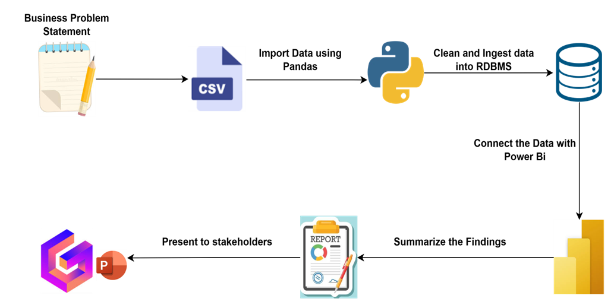
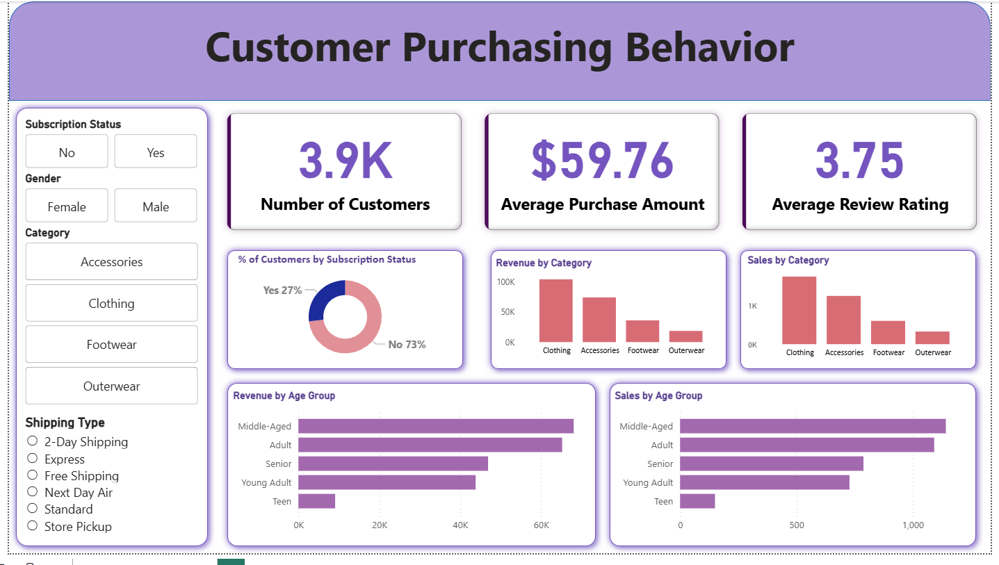

# 👨🏻‍💻 Customer Purchasing Behavior Analytics Project

## 📌 Overview
This project analyzes customer purchasing behavior using Python, SQL, and Power BI.  
The objective is to uncover insights into spending patterns, demographics, product preferences, subscription impact, and shipping behavior to support data-driven decisions and translate raw data into strategic business intelligence by:

✅ Data Preparation,Modeling & Exploratory Data Analysis (Python): Clean and transform the raw dataset for analysis.

✅ Data Analysis (SQL): Simulate business transactions, and run queries to extract insights on customer segments, loyalty, and purchase drivers.

✅ Visualization & Insights (Power BI): Build an interactive dashboard that highlights key patterns and trends, enabling stakeholders to make data-driven decisions.

✅ Report and Presentation: Write a clear project report summarizing your key findings and business recommendations. Prepare a presentation that visually communicates insights and actionable recommendations to stakeholders.


---

## 📂 Dataset
**Size**
- 📊 ~3,900 rows
- 🧾 18 columns  

**Includes**
- 👥 Customer demographics  
- 🛒 Purchase behavior & spending patterns  
- ⭐ Review ratings  
- 🚚 Shipping preferences  
- 🎟️ Discounts & promo behavior  

> Source: [customer_shopping_behavior.csv](data/customer_shopping_behavior.csv)

---
## 🛠️ **Clone the repository**

   ```bash
   git clone https://github.com/Mahesh77300/Customer-Shopping-Behavior-Analysis.git
   cd Customer-Shopping-Behavior-Analysis
   ```

## 🧰 Tools & Technologies

| Category | Tools |
|---|---|
💻 Programming | Python  
🗄️ Database | Postgre SQL 
📊 BI | Power BI  
📦 Libraries | Pandas, NumPy, SQLAlchemy, Matplotlib, Seaborn  


## 🏗️ Architecture Diagram




---

## 🔎 Project Workflow

### 1️⃣ Data Loading & EDA (Python)
- Loaded dataset using pandas
- Summary statistics, distributions, visual patterns

### 2️⃣ Data Cleaning & Preparation
- Fixed missing review values  
- Standardized column names  
- Feature engineering:
  - 🎯 Age groups  
  - 🔁 Purchase frequency segmentation  
- Loaded cleaned data to SQL db

### 3️⃣ SQL Insights
Queries performed:
- 👤 Spend by gender & age group
- 💳 Subscription vs non-subscription spend
- 🏷️ Discount utilization analysis
- ⭐ Top-rated products
- 🚚 Shipping method behavior
- 🔁 Repeat customer analysis

### 4️⃣ Power BI Dashboard
Key visuals:
- 📈 Revenue by category
- 👥 Revenue by age group
- 📦 Subscription contribution
- ⭐ Review distribution
- 🛍️ Order volume by category

📸 **Dashboard Preview**
-



<br>
<br>
<br>

📊 Power BI Dashboard Link : [Dashboard Link](https://github.com/Mahesh77300/Customer-Shopping-Behavior-Analysis/blob/main/powerbi/Customer%20Shopping%20Behavior%20Dashboard.pbix)


---
### ✅ Key Insights

👕 Clothing generates highest revenue

👨‍🦳 Middle-aged & 🧑 adults spend the most

💠 Subscribers have higher spend per purchase

🔖 Discounts boost volume but need margin control

🎯 High-frequency customers behave like loyal members

### 🎤 Presentation

📎 Gamma PPT Link: [Gamma PPT Access](https://gamma.app/docs/Customer-Shopping-Behavior-Analysis-lx8fmq5kemthmje?mode=doc)

<br>

## 👨‍💻 Author

Mahesh Krishna Bandla – [LinkedIn](https://www.linkedin.com/in/mahesh-krishna-bandla-219b3a186/) | [GitHub](https://github.com/Mahesh77300)

